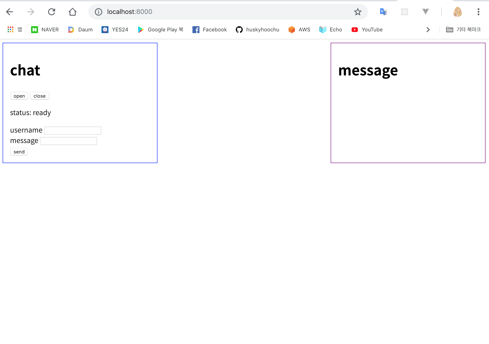
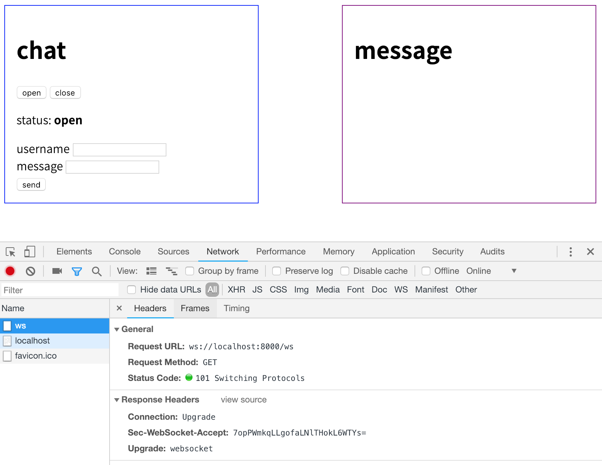
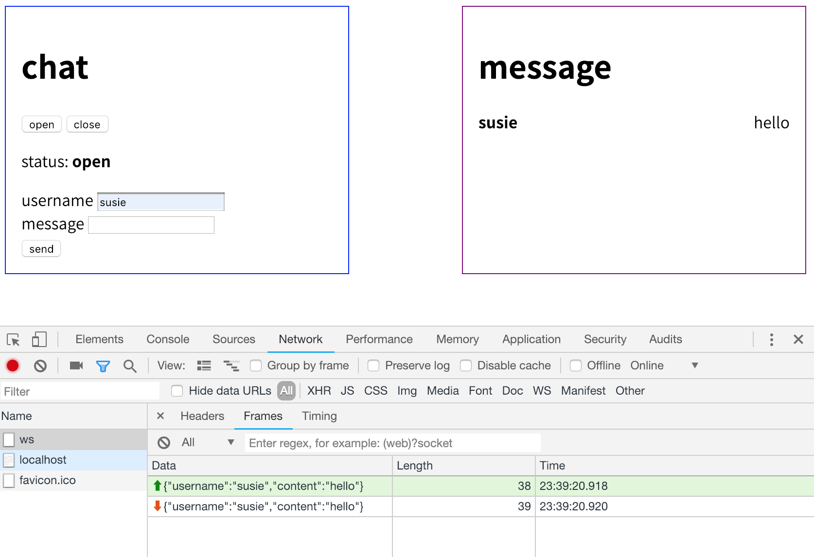
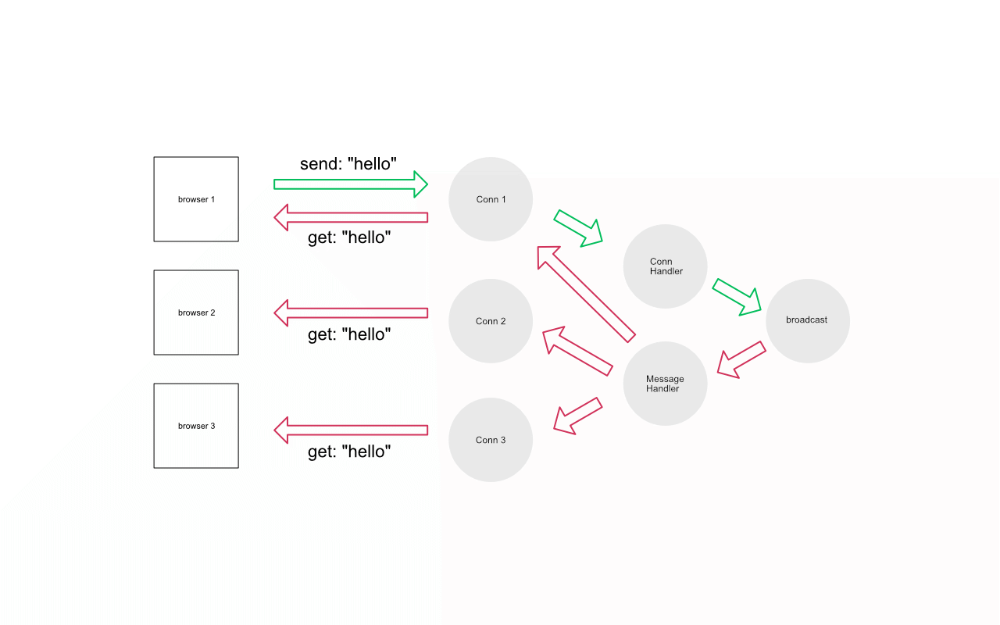
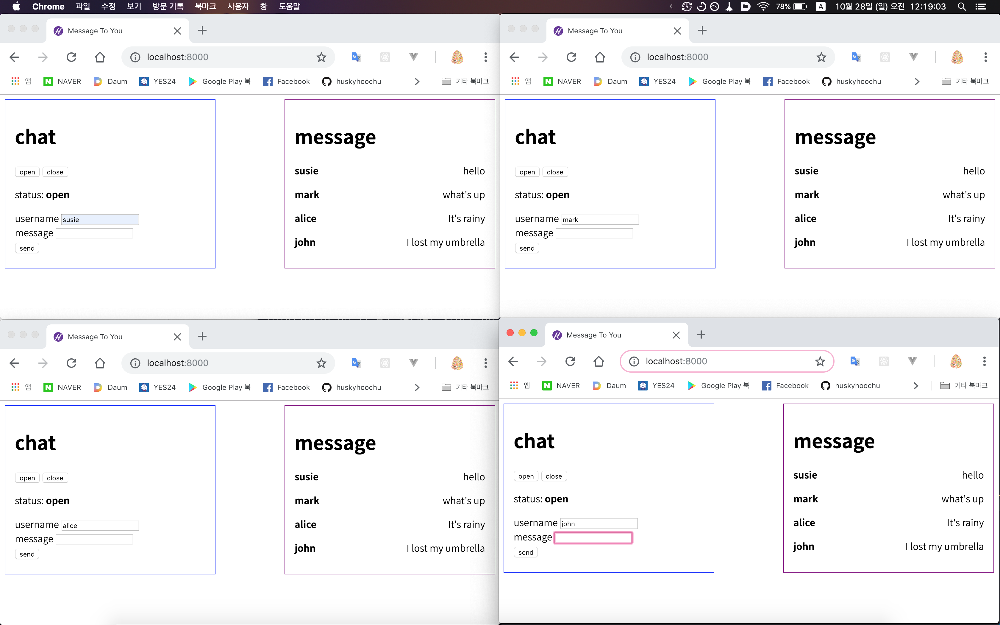

# Send Message App

## 개요

하나의 네트워크에 연결된 두 머신이 서로 메시지를 주고받는 어플리케이션을 개발했습니다. "어떤 방식으로 통신하게 할 것인가?"를 가장 오래 고민했습니다. 문제에는 Form 1이 Form 2에게 단방향으로 메시지를 전달하는 설계를 주문하는 것처럼 보였으나, 애초에 두 머신이 같은 프로그램을 사용하고 있는 거라면 Form 1과 Form 2 사이의 계층적 차이는 사실상 없다는 결론을 내렸습니다. 즉 양방향 통신이 가능해야 한다는 생각이 들었습니다.

두 머신 간의 양방향 통신을 간단하게 구현하는 데에는 WebSocket이 적격이라고 판단했습니다. WebSocket은 http 프로토콜을 이용하기 때문에 웹 브라우저를 통해 GUI 환경을 꾸릴 수 있다는 장점이 있습니다.


## WebSocket이란?

WebSocket은 웹 브라우저와 서버 간의 양방향 채널을 만들기 위한 프로토콜입니다.  기존의 http 프로토콜은 handshake - request - response 를 거친 뒤에 반드시 연결이 끊어지는 구조로 되어 있었습니다. 그래서 지속적으로 연결을 유지해야 하는 경우 부담이 많았습니다. 이를 극복하기 위해 Long Polling 등의 기술이 나오기도 했는데요. 통신이 길어질수록 오버헤드가 많아진다는 단점은 그대로였습니다.

WebSocket은 http와 완전히 다른 프로토콜을 사용함으로써 근본적으로 문제를 해결했습니다. http는 첫 handshake 때에만 쓰이고, 그 다음부터는 protocol switching이 일어나 WebSocket 프로토콜에서 통신이 일어납니다.


## 기술 스펙

웹 서버를 편리하게 짤 수 있는 golang(1.11.1)을 사용했고, golang에서 폭넓게 사용되는 gorilla websocket 패키지를 사용했습니다. 웹페이지를 구현할 때는 아무 라이브러리도 사용하지 않았습니다.

## 파일 구조

```
.
├ main.go  // 실행 파일
├ model.go // 메시지 자료구조
├ conn.go // WebSocket 커넥션 및 go channe
├ handler.go // 각 요청에 대응하는 핸들러
└ index.html // 클라이언트 웹페이지 및 메서드
```

## 설치 및 실행

먼저 `go 1.11.1` 과 의존성 패키지인 `dep`을 설치해주십시오.

[go 1.11.1](https://golang.org/dl/)

[go dep](https://github.com/golang/dep)


그리고 `$GOPATH` 에 소스코드를 설치해주십시오.

```
$ go get github.com/brique-test/message
```

소스코드 디렉터리로 이동한 뒤 `dep`을 실행해 의존성 패키지를 설치합니다.

```
$ cd message
$ dep ensure
```

그 다음 소스코드를 빌드한 뒤, 바이너리 파일을 실행하시면 됩니다.

```
$ go build
$ ./message
```

정상적으로 실행되었다면 다음과 같은 메시지가 출력될 것입니다.

```
$ 2018/10/27 23:22:59 Server start on port 8000
```

이제 웹 브라우저에서 `localhost:8000` 에 접속하면 서버 내부의 html 핸들러가 `index.html`을 전달하면서 페이지가 나타납니다.




## 사용법

어플리케이션은 메시지를 입력하는 **chat box**와 입력된 메시지가 쌓이는 **message box**로 나뉩니다.

**chat box**의 open/close 버튼은 WebSocket 커넥션을 켜고 끄는 역할을 합니다. open 버튼을 누르면 서버와 웹소켓 커넥션이 열리면서 하단 status 플래그가 open으로 바뀌게 됩니다.



이제 username과 message를 입력하고 send 버튼을 눌러봅시다.



브라우저에서 메시지를 전송하는 순간, 서버 내부의 커넥션 핸들러는 커넥션에 새로운 메시지가 들어왔음을 감지합니다. 그러면 커넥션 핸들러는 커넥션에서 메시지를 읽어들여 `broadcast`라고 이름붙인 goroutine 채널 객체에 추가합니다.

이때 goroutine으로 실행 중인 메시지 핸들러는 `broadcast`에 새로운 메시지가 들어왔음을 감지합니다. 메시지 핸들러는 현재 서버와 소통 중인 모든 커넥션에게 새로 들어온 메시지를 전달합니다.

그러면 커넥션에서 message 이벤트가 발생하고, `ìndex.html`안에 미리 정의해 둔 이벤트 리스너는 이벤트를 통해 날아온 메시지를 DOM 객체로 만들어 **message-box**에 띄웁니다.

이 흐름을 간단한 도식으로 그려보면 아래와 같습니다.



커넥션이 몇 개가 되든 핸들러가 컨트롤할 수 있기 때문에, 두 개 이상의 프로세스가 열려도 메시지는 무리없이 전달될 수 있습니다.



